<h1 align="center"><strong>GlobALE Beer Store</strong></h1>

[View live project here](https://globale-beerstore-jm.herokuapp.com/)

**The 'one-stop shop' for finely crafted beers from around the world**

<h2 align="center"></h2>

The beer market and average beer consumer have changed drastically over the past decade or so, which has led to hundreds of craft beer makers popping up all over the world, as well as the emergence of longer-standing, small-scale brewers who have risen to prominence due to the high quality of their beers. 

No longer satisfied with having a slim choice between the 'super brands' at their local bar or supermarket, beer consumers are demanding a wider selection, higher quality and varied tastes, from wheat beers and lagers, to Indian Pale Ales (IPAs) and coffee stouts. The sheer multitude of options now available to beer drinkers on supermarket shelves and on tap or behind the counter of many bars is evidence of how much the market and consumer has changed. 

In many ways, modern beer consumers have become more like wine enthusiasts – amateur connoisseurs with a keen interest in ingredients, blends, colors, quality, the origin of the beer, and detailed "wine-like" descriptions of a beer's taste. Friends' conversations over a beer are now often about the beers themselves, with each offering recommendations to "try this" and "try that".  At the same time, the e-commerce market continues to grow, with many consumers turning to the Internet to buy everything from clothes, music and electronics, to take-out meals, groceries and beer. 

In response to these market changes, the GlobALE digital beer store has been established as a "one-stop shop" for the modern beer fan eager to try beers from around the world. GlobALE offers a wide selection of traditional and craft beers, available to be searched by category or country. Users have access to a simple-to-use interface adapted to varied screen sizes for improved UX (laptop, tablet or phone), which allows them to easily browse, select and buy beer with a few clicks of their mouse, and have it delivered to their doorstep. GlobALE is a celebration of the fine craft undertaken by beer makers from around the world, from Bogota to Dublin, from California to Tokyo and beyond -- offering customers a "Passport to Beeradise".

**Features:**

- Browse beers by country, category or key words
- Choose beers, add to shopping cart and pay using secure Stripe payments system
- Create user profile to store delivery information, past orders, and file order issues
- Leave reviews and ratings on beers for the GlobALE community
- Store owners: add beers, edit and delete beers and deal with customer order issues

<hr>

## **USER STORIES**

### **<u>Visitor Goals</u>**

**General searching and browsing**

1. I want to easily understand the main purpose of the website and quickly understand its structure.

2. I want to generally browse all of the products on the GlobALE store

3. I want to search products available on the GlobaALE store by category.

4. I want to find a particular product I am interested in by name or description.

5. I want to view more detailed information on a particular product I am interested in purchasing.

**Log In, Registration and User Profiles**

1. I want to sign up as a registered user of the GlobALE store.

2. As a registered user, I want to sign in to the GlobALE store.

3. As a signed in user, I want to view my personalized user profile and make add/update my delivery details.

4. As a signed in user, I want to view past orders. 

5. As a signed in user, I want to log out of the GlobALE store. 

6. As a signed in user, I have forgotten my password and would like to reset it in order to sign in.

**Storing items for purchase and making purchases**

1. Having chosen a project I want to purchase, I want to select the quantity of the product and add it to a shopping cart to make it available for purchase at a later point. 

2. I want to easily view my shopping cart at any point, and delete or update products or items currently in my shopping cart.

3. I want to proceed to purchase the items in my shopping cart.

4. I want to easily add my delivery details and make a secure payment with my credit card. 

**Post-purchase**

1. I want to view an order/payment confirmation.  

2. I want to contact GlobALE to file an issue or query about a particular order.

3. I want to leave feedback/review of a product for fellow site users.


### **<u>Site Owner/Admin Goals</u>**

**Product management**

1. I want to add a new product to the GlobALE store.

2. I want to update/edit an exisiting product on the store.

3. I want to delete an existing product on the store.

**Customer queries, issues**

1. I want to view customer order issues or queries.

2. I want to deal with and manage customer query issues.

<hr>

## **TECHNOLOGIES USED**

### **Languages Used**

-   [HTML5](https://en.wikipedia.org/wiki/HTML5)
-   [CSS3](https://en.wikipedia.org/wiki/Cascading_Style_Sheets)
-   [Javascript](https://en.wikipedia.org/wiki/JavaScript)
-   [Python](https://en.wikipedia.org/wiki/Python)


### **Frameworks, Libraries & Programs Used**

- [Bootstrap 4](https://getbootstrap.com/): Bootstrap 4 is used to assist with the responsiveness, positioning and styling of elements of the website. 
- [jQuery](https://jquery.com/): jQuery is used for the navbar toggler function, and for user interactivity (e.g. to dynamically show, hide, add and delete elements acorss the website).
- [Django](https://www.djangoproject.com/): The Django Framework and the Jinja templating language are used to develop the full-stack web-based appplication using Python.
- [Gitpod](https://github.com/): Gitpod is used as the IDE to develop the project.
- [Git](https://git-scm.com/): Git is used for version control by utilizing the Gitpod terminal to commit to Git and Push to GitHub.
- [GitHub](https://github.com/): GitHub is used to store the projects code after being pushed from Git.
- [Heroku](https://www.heroku.com/): Heroku is used to deploy the project to the web and is linked to the GitHub repository (see more in Deployment section)
- [Stripe](https://stripe.com/): Stripe is used for the secure processing of payments.
- [Amazon Web Services](https://www.mongodb.com/): Amazon Web Services is used to store static files and media files for the deployed project


<hr>

## **DESIGN**

### **Colors**

   - The brand colors, navy blue, white and orange have been user across the sight, while light greys have been used for muted texts and dividers.

      

### **Fonts**
 - The 'Antonio' font has been used for the logo and headings throughout the site, with 'Sans Seriff' as backup.

 - The 'Noto Sans' font has been used for main content throughout the site, with Sans-Seriff as backup.

 - ['Antonio'](https://fonts.google.com/specimen/Antonio) and ['Noto Sans'](https://fonts.google.com/specimen/Noto+Sans) have both come from Google Fonts.

### **Imagery**
- The main homepage image, featruing a silhouette of he map of the world on a head of beer, has been chosen to represent 'Beers of the World'

- Credit: This image has come from ShutterStock and is by Sergey Peterman. [See original image here](https://www.shutterstock.com/es/image-photo/global-beer-concept-world-map-silhouette-1408420616). (Developer has rights to the image through ShutterStock subsciption) 

- The rest of the imagery on the site pertains to product photos.

- All images were pre-cropped or resized using an online image editro, [BeFunky.com](https://www.befunky.com/) 

### **Icons**

- A series of icons have been used throughout to to improve user experience.

- All icons have come from [Font Awesome](https://fontawesome.com/)

### **User Interface Design**
 - The intial wireframes for the project were created using [Balsamiq](https://balsamiq.com/) and can be viewed here: 
   - Medium/Large screens 
   - Mobile screens

### **Database Design**
- A relational database model was used for the database design:
   - The database used in development is sqlite3 (as provided by Django).
   - The database used in production is PostGres (as provided by Heroku). More info on setting up the Postgres database can be found the Deployment section below.
   
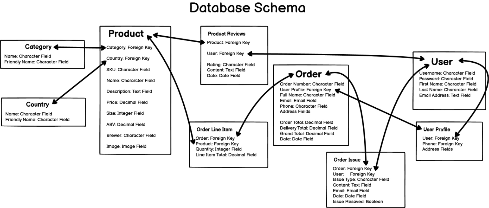

<hr>

## **DEVELOPMENT**


- First, a repository for the project was created on GitHub, which is connected to the [Gitpod online IDE](https://www.gitpod.io/).

-  The project was developed using the Gitpod online IDE, using HTML, CSS, Python and Javacript, as well as the Django, Bootstrap and JQuery frameworks. 

- In the GitPod project workspsace, Django was installed using the CLI: 
   - type: ***pip3 install django*** 

- Before creating a Heroku app (as outlined in the Deployment section), a requirements.txt file was created in the project on the Gitpod IDE in order to tell Heroku what applications and dependencies are required to run the application (image below shows the contents of the requirements.txt file). The requirements.txt file was created using the CLI: 

   - type: ***pip3 freeze > requirements.txt***

   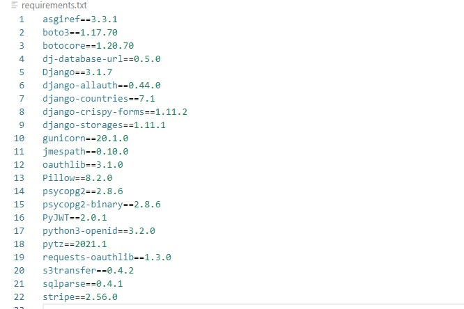

-   The project was regularly commited using the Git command line interface on Gitpod.
-   After each commit, the project was pushed to Github, and then later pushed to Heruko for deployment (see more inDeployment section)

<hr>


## **Deployment**

### <u>**Setting up a Postgres database and deploying to Heroku**</u>

**Creating the Postgres database to be used with Heroku**:

1. Create a new app on Heroku. 
2. Once the app is created, go to the Resources tab and select "Heroku Postgres" database as an add-on. 
3. To use Postgres, it's necessary install dj-database_url and psycopg2 on Gitpod. Back on the project workspace on Gitpod, download these in the CLI using pip3 install:
   - ***pip3 install dj_database_url*** 
   - ***pip3 install psycopg2-binary***
4. Add these to the requirements.txt file by typing: ***pip3 freeze > requirements.txt*** in the CLI. This is to make sure that Heroku installs all the app's requirements when it is deployed.
5. To set up the new databases, go to settings.py and import dj_database_url. Then scroll down to the Databases section and add the dj_database_url and include the 'DATABASE_URL' provided by Heroku. This can be found in the Config Variables section of the Settings tab in Heroku and begins with 'postgress:..'
 

6. To run migrations to the new database, first temporarily "comment out" the exisiting sqlite3 database and then type: ***python3 manage.py migrate*** into the CLI.

7. Steps to dump data from existing sqlite3 database to new Posgres database:
   - Reconnect manage.py to the sqlite3 database by "commenting out" the new dj_database and uncommenting the sqlite3 database
   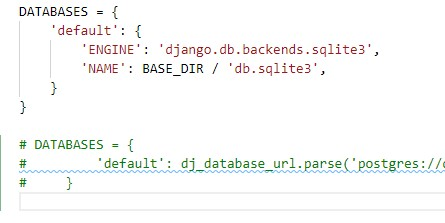 
   - In the CLI, type: ***./manage.py dumpdata --exclude auth.permission --exclude contenttypes > db.json*** . This creates a db.json file containing all the data from the sqlite3 database.
   - Once again reconnect manage.py to the new Postgres database by commenting out the sqlite3 database and uncommenting the dj_database
   - To load data from the db.json file into Postgres, type in the CLI: ***./manage.py loaddata db.json***
8. To create a new superuser for the Postgres database, type in the CLI: ***python3 manage.py createsuperuser***. As prompted, enter username, email and password. 
9. At this point, before committing these changes to Github: remove the dj_database config and uncomment the original database. Commit and push to Github. 
10. Now to set up an easy switch between the default database and Postgres database, add the following "if-else" statement in the DATABASES section of settings.py.
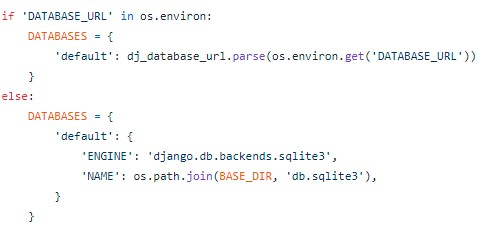 

**Deploying to Heroku:**

1. Next, install gunicorn by typing into the CLI: ***pip3 install gunicorn*** and then type ***pip3 freeze > requirements.txt*** to add this file to the requirements.txt file.
2. Create a Procfile, and in it, add on line 1: ***web: gunicorn globale_store.wsgi:application***
3. Log into Heroku on the CLI by typing: ***heroku login -i*** and enter credentials.
4. Temporarily disable collectstatic, by typing in the CLI: ***heroku config:set DISABLE_COLLECTSTATIC=1 --app < heroku app name >*** 
5. Add the heroku app and localhost to the ALLOWED_HOSTS in settings.py as follows: ***ALLOWED_HOSTS = ['< heroku app name >.herokuapp.com', 'localhost']*** 
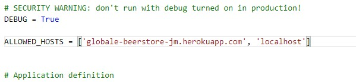 
6. At this point, commit and push changes to Github.
7. Then push changes to Heroku:
   - first type in CLI: ***heroku git:remote -a < heroku app name >***
   - then type: ***git push heroku master***
8. At this point, go to the app in Heroku and set up automatic deployments from Github:
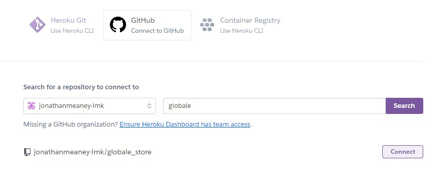 
   - In the Deploy tab, click 'Connect to Github' in the Deployment Methods section
   - Search for the app and click 'Connect'
   - Once connected, click 'Enable Automatic Deploys'
9. Now is the time to remove the original secret key from settings.py and add a new secret key to the environment variables section in Heroku:
   - Generate a random secret key using a Django Secret Key Generator
   - Add the SECRET_KEY to the environment variables in Heroku.
   - Do the same process for Gitpod (generate a different key)
   - In settings.py, set the SECRET_KEY variable to get the value from the environment, using an empty string as default.
   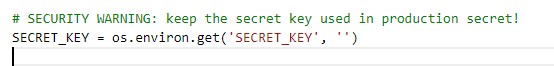 
10. In settings.py, set DEBUG to be true only when there is a DEVELOPMENT variable in the environment. Then add a DEVELOPMENT variable equal to True in the Gitpod environment (NOT in Heroku).
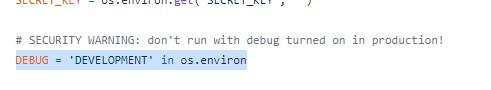 
11. At this point, commit and push changes to Github, which will automatically push changes to Heroku. 

### <u>**Setting up Amazon Web Services to host static and image files**</u>

**Creating an S3 bucket and setting up the bucket configuration:**

1. Having set up an AWS account, head to the AWS management console and search for the S3 service.

2. Once on the S3 service, click 'Create Bucket' and choose a Bucket Name (same as Heroku app, recommendable) and region (closest). Make sure to uncheck 'Block All Public Access' and check 'Acknowledge public access'. Then scroll down and click 'Create Bucket'.

3. Once redirected to the bucket list, click on the new bucket to change necessary settings.

4. Click on the Properties tab and scroll down to Static Web Hosting. Click the 'Edit' button and then enable static web hosting. Input ***index.html*** for the index document and ***error.html*** for the error document, as prompted. Scroll down and click 'Save Changes'.

5. Next, click on the Permissions tab, scroll down to CORS configuration, click 'Edit' and paste in the following code below, and then click 'Save Changes'.

   ```
   [
     {
         "AllowedHeaders": [
             "Authorization"
         ],
         "AllowedMethods": [
             "GET"
         ],
         "AllowedOrigins": [
             "*"
         ],
         "ExposeHeaders": []
     }
   ]
   ```

   

6. Staying inside the Permissions tab, go to Bucket Policy and click 'Edit'. Then click 'Policy Generator' and fill out the form:

   - for Select Policy Type, choose: 'S3 Bucket Policy' 

   - for Effect, choose: 'Allow', as automatically selected

   - for Principal, add * to allow all principals

   - for Actions, select: 'Getobject'

   - for Amazon Resource Name, copy and paste the 'arn' from the Edit Bucket Policy tab (e.g. arn:aws:s3:::globale-beerstore-jm)

    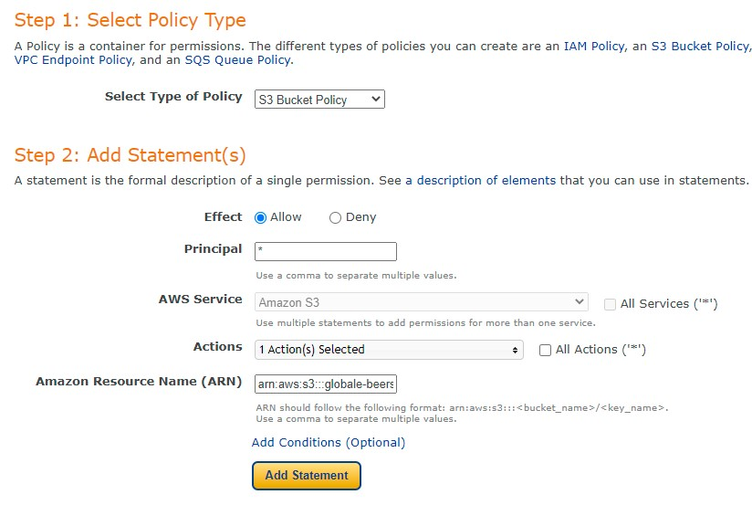 

7. Click 'Add Statement', followed by 'Generate Policy', and then copy and paste the generated object code into the Bucket Policy Editor. In the Resource key of the generated object, add ***/**** at the end of the value (as in pic below). Then click 'Save Changes'. 
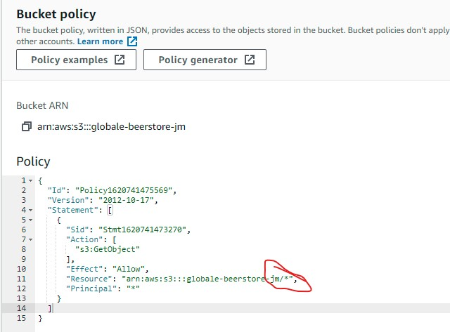 
8.  Staying inside the Permissions tab, go to Access Control List and click 'Edit'. In the 'Everyone (Public Access)' section check the 'List' box in the Objects column. Then scroll down and click 'Save Changes'.

**Creating a group and user to allow access to the bucket using IAM:**

*The three-step process here is: first create a group for where the user can live; second, create an access policy giving the group access to the new S3 bucket created; third, assign the user to the group so they can use the policy to access all the S3 bucket files.*

1.  In the AWS services menu, open IAM (Identity and Access Management)
2. To create a group:
   - Go to 'User groups' in the IAM dashboard and click 'Create Group' 
   - Choose a group name (e.g. manage-globale-store)
   - Scroll down and click 'Create Group'.
3. To create a policy: 
   - Go to 'Policies' in the IAM Dashboard and click 'Create Policy' 
   - In the 'Create Policy' section, go to the 'JSON' tab and then click 'Import managed policy'. Here search for 'S3', choose 'AmazonS3FullAccess' and press 'Import' to generate the JSON object. 
   - For the Resource key in the generated JSON object: copy and paste the bucket ARN (go back to S3-Bucket Policy to get the ARN) twice into a list, with the second ARN value containing ***/**** at the end. This is to allow actions in the bucket itself and everything in it. See pic below: 
   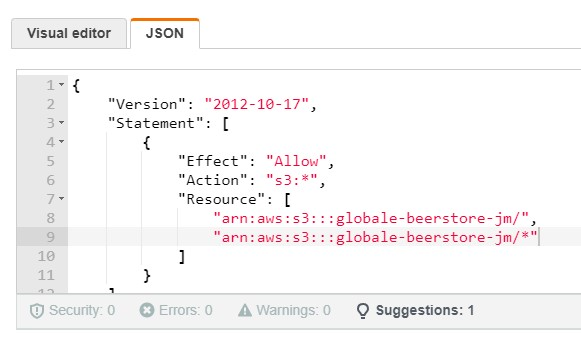 
   - Click 'Next-tags' and then click 'Next-review'. Add a name (e.g. globale-beerstore-jm-policy) and a description (e.g. Access to S3 bucket for globale static files), and then click 'Create Policy'
4. To attach the policy to the group: 
   - Go to 'User groups' in the IAM dashboard and click on the relevant group. 
   - Go to the 'Permissions' tab and click 'Add Permissions' > 'Attach Policy'. Select the newly created policy and click 'Add Permissions'.
5. To create a user to add to the group: 
   - Go 'Users' in the IAM dashboard and click 'Add User'.  
   - Give the user a name (e.g. global-static-files-user) and check the 'Programmatic Access' box in 'Access Type'. Then click 'Next-Permissions'. Add the user to the relevant group and click 'Next-tags', click 'Next-Review' and then finally 'Create User'
   - Once the user is created, download the .csv file (This contains the users access keys, which are used to authenticate the user from the Django app). Be sure to save this .csv file somewhere safe as it cannot be downloaded again. 

### **<u>Connecting Django to S3</u>**

1. Return to the gitpod project workspace and install two new packages in the CLI:

   - ***pip3 install boto3***
   - ***pip3 install django-storages***

2. Then type ***pip3 freeze > requirements.txt*** to add these files to the requirements.txt file.

3. Go to settings.py and add 'storages' to the INSTALLED APPS list.

4. Staying in settings.py add the following code under MEDIA_ROOT and MEDIA_URL:
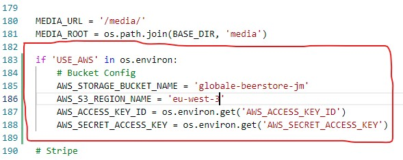 
5. Go to Heroku app and add the AWS access keys to the Config Variable in the Settings tab. (Both these keys come from the .csv file downloaded in step 5 above in 'Creating a group and user to allow access to the bucket using IAM')
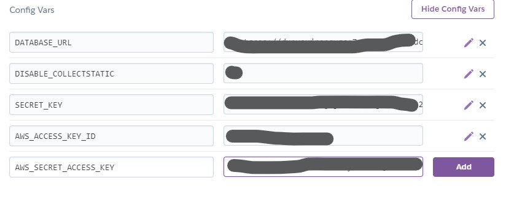 

6. Here, also add the USE_AWS variable and set it to True, so that the settings.py file knows to use the AWS configuration when deployed to Heroku. At this point, also remove the DISABLE_COLLECTSTATIC from the Config Vars.

7. In order to tell Django where static files will be coming from in production, first add the following line of code in the AWS section in settings.py:
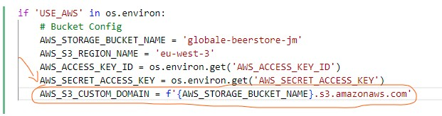 

**The next steps involve telling Django that in production to use S3 to store static files whenever someone runs COLLECTSTATIC and to send any uploaded images to go there also.**

1. Create a file called **custom_storages.py** and add the following code to that file:
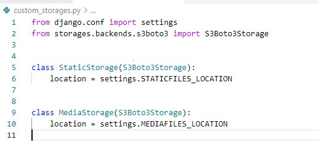 
2. Back in settings.py, add the following code:
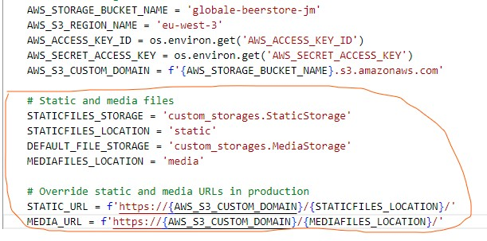 
3. At this point, commit and push these changes toGithub, which will automatically deploy thesechanges to Heroku.
4. Static files will now be sent to the AWS S3bucket and accessible to Heroku.
5. Back in settings.py, add the following code (which will tell the browser that it's okay to cache static files for a long time in order to improve user performance):
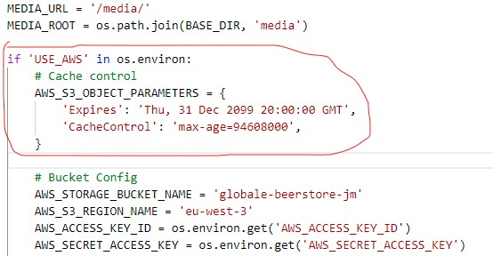 
6. At this point, commit (e.g. commit -m "Added cache control") and push these changes to Github
   
**Adding media files to S3:**

1. Go to back to the S3 bucket for the project and in it create a new folder called 'media'
2. Inside the media folder, click 'Upload' and then 'Add Files'. Add the relevant images from the project's media folder (download from Github repo) and click 'Open'.
3. Before clicking 'Upload', select 'Grant Public Read Access' in the 'Predefined ACLs' section. Then click 'Upload'

### <u>**Final steps**</u>

1. Verify Superuser in Django admin in Postgres database: 

    - From the deployed version of the project, go to the Emails model in Django admin and set the Superusers email to verified (if not verified already).

2. Setting up Stripe with the Heroku App:  

    - Add Stripe keys to the Config Variables in the Settings section of the Heroku App. These keys can be retrieved from the Stripe dashboard. 
    - To setup a new webhook and generate a new webhook secret key (STRIPE_WH_SECRET): 
        - go to Webhooks in the Stripe dashboard and click "Add End Point'. Add the URL for the Heroku app address followed by ***/checkout/wh*** .
        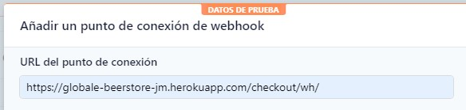 
        - Select 'Receive all Events' and then click 'Add End Point'. 
        - Now copy and paste the new webhook secret key into the Heroku config variable
        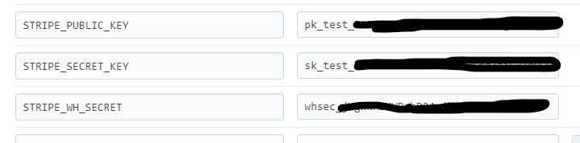 

<hr>

## **TESTING**
   
[Click here to find to the Testing Document](TESTING.md).

Contents:

 - User Stories Testing
 - Functionality Testing
 - Code Validation

