# **TESTING** 

- The website was tested on Google Chrome, Microsoft Edge, Firefox and Safari browsers.
- The website was viewed on a variety of devices such as Desktop, Laptop, Tablet, iPhone 6s, iPhone SE, Huawei Y6, Huawei P9 and Samsung Phones. The website was found to be responsive across all of these devices. 
- A large amount of testing was done to ensure that all pages were linking correctly, and buttons and forms sections were working as intended (more details below).
- Friends, family members and fellow Code Institute students were asked to review the site and documentation to point out any bugs and/or user experience issues.

## **USER STORIES TESTING**

*Note that the actual functionality testing of the features outlined in the User Stories section will be covered in the Functionality Testing section.*

### **<u>Visitor Goals</u>**

### **General searching and browsing**

**1. I want to generally browse all of the products on the GlobALE store**

- On landing on the homepage, users can click on the 'All Products' navbar link or 'BUY BEER' call-to-action button to see a list of all products available on the store.

**2. I want to search products available on the GlobaALE store by category**

- Users can click on the 'Category' or 'Country' navbar links to browse the products by beer type (ales, lagers, stouts, etc.) or by country.

**3. I want to find a particular product I am interested in by name or description**

- Users can search for a particular product by typing keywords in the Searchbar located in the navbar, which will display a list of results of products containing the keywords entered.

**4. I want to view more detailed information on a particular product I am interested in purchasing**

- Users can click on the product, which will direct them to the product detail page, which contains more detailed information on the product, including description, brewer, size, ABV, and a list of product reviews. 

### **Log In, Registration and User Profiles**

**1. I want to sign up as a registered user of the GlobALE store**

- Users can click on the Profile dropdown menu in the navbar and choose 'Register'.
- On the Register page, they can fill out the simple registration form which will prompt a verification link to be sent to their email once they submit the form. They will be instructed to go their email to verify their email address through the link.
- After clicking on the verification link in the email, they will be redirected to the site's Confirm Email page. Upon pressing 'Confirm', the new registered user will be directed to the Sign In page, where they can log in with their new details. A message will appear to say thay their email has been confirmed successfully.

**2. As a registered user, I want to sign in to the GlobALE store**

- Users can click on the Profile dropdown menu in the navbar in the navbar to choose 'Sign In'
- Having entered their credentials correctly in the Sign In form, users can click 'Sign In', which will display a message to inform them that they have signed in correctly.

**3. As a signed in in user, I want to view my personalized user profile and add/edit my delivery details for storage**

- Users can click on the Profile dropdown menu in the navbar and choose 'My Profile'.
- Here they can add or update their delivery details by filling out/updating the form and click 'Update Information'. A message will appear to say that they have updated their information successfully.

**4. As a signed in user, I want to view past orders**

- Users can click on the Profile dropdown menu in the navbar and choose 'My Profile'.
- Here they can view a list of all past orders. For each order they can click to 'See Details' or 'File Issue'. 

**5. As a signed in user, I want to log out of the GlobALE store**

- Users can click on the Profile dropdown menu in the navbar and choose 'Log Out'.
- Having clicked the 'Log Out' button on the Log Out page, a message will appear to say that they have successfully logged out of the system. 

**6. As a registered user, I have forgotten my password and would like to reset it in order to sign in.**

- On the Sign In page, users can click the 'Forgot Password' link, which takes them to the Password Reset page. 
- Having entered their email address and clicking 'Reset My Password', they are informed that they have received an email. Clicking on the link in this email will take them to the Change Password page.
- On the Change Password Page, they can enter their new Password. Once they submit, a message will appear to say their password has been successfully updated. 
- At this point, they can now successfully sign in with their new password. 

### **Storing items for purchase and making purchases**

**1. Having chosen a project I want to purchase, I want to select the quantity of the product and add it to a shopping cart to make it available for purchase at a later point.**

- Users can click on the chosen product to open the product detail page (as described above in the General searching and browsing section). Here they can use the input bar to select a quantity from 1-99. 
- Clicking 'Add to Cart' will add the desired quantity of the product to their shopping cart. A message will appear to say that the desired quantity of the selected product has been added to their cart. 

**2. I want to easily view my shopping cart at any point, and delete or update products or items currently in my shopping cart.**

- Users can access their shopping cart by clicking on the Shopping Cart icon in the navbar. 
- Here they can see all of the items in their shopping cart, as well as all relevant cash totals (line item subtotal, final order total, delivery charge and grand total).
- Users can easily update the quantity of products by using changing the quantity in the input bar and clicking update. A message will appear to say that the product quantity has been updated successfully.
- Users can easily delete a product by clicking the delete button (represented by a trashcan icon). A message will appear to say that the product has been deleted successfully.

**3. I want to proceed to purchase the items in my shopping cart.**

- On their Shopping Cart page, once users are happy with the content of their cart, they can proceed to the checkout page by clicking the 'Go to Checkout' button. 

**4. I want to easily add my delivery details and make a secure payment with my credit card.**

- On the Checkout Page, users can fill out the form broken into three fields: Name & Email, Delivery Details, and Payment.
- The Email and Delivery Details fields will be autofilled for registered users who have added their delivery information to their profile page.
- Once the three form fields have been completed correctly, the user can click 'Complete Order' to confirm the order and payment. They will then be directed to the Order Confirmation Page, which includes their order number and a review of their order.   

### **Post-purchase**

**1. I want to view an order/payment confirmation.**

- Users will be directed to their Order Confirmation page once they Complete an order (as described directly above).
- Registered users can view order confirmations by clicking on the Orders section of the Profile dropdown menu in the navbar (as outlined in the Log In, Registration and User Profiles section above).
- Both registered and unregistered users will recieve a confirmation email once an order is completed.

**2. I want to contact GlobALE to file an issue or query about a particular order.**

- Registered users can file an issue about a particular order by clicking on the Orders section of Profile dropdown menu. Here they can click the 'File Issue' button on the order in question, which will direct them to the Submit an Order Issue page.
- On the Submit an Order Issue page, they can fill out the simple Issue form. Clicking 'Submit' will file their issue with admin. A message will appear to say that the issue has been logged successfully.
- Unregistered users can file an issue or query by responding to the Order Confirmation email they received when they completed their order. 

**3. I want to leave feedback/review of a product for fellow site users.**

- Registered and logged in users can access the Leave a Review form on the Product Detail page. 
- Having filled out the form and clicked 'Submit', their review will be immediately added to and appear on the Reviews section of the Product Detail page. They will receive a message to say that their review has been submitted successfully.  

### **<u>Site Owner/Admin Goals</u>**

### **Product management**

**1. I want to add a new product to the GlobALE store.**

- Admin users can click on the Profile dropdown menu in the navbar and choose 'Product Mangagement' which will take them to the 'Add a Product' page.
- Having filled in the form correctly and clicked 'Submit', the new product will be added to the database.
- Users are then directed to the Product Detail page for the new product. A message will appear to say that the new product has been added successfully. 

**2. I want to update/edit an exisiting product on the store.**

- Admin users can click on the 'Edit' link on the Products page or Product Detail page. This will direct them to the 'Edit a Product' page. This link only appears for admin users.
- On the Edit a Product page, users can make any neccesary changes to the prefilled form. The form is prefilled with the product's existing details. 
- Having updated the form correctly and clicked 'Submit', the changes will be applied to the product on the database.
- Users are then re-directed to the product detail page where they can see the changes applied. A message will appear to say that the product has been updated successfully. 

**3. I want to delete an existing product on the store.**

- Admin users can click on the 'Delete' link on the Products page or Product Detail page. This link only appears for Admin users.
- Clicking this link will remove the product from the database. A message will appear to say that the product has been deleted successfully. 

### **Customer queries, issues**

**1. I want to view customer order issues or queries.**

- Admin users can log into the Django admin to view a list of order issues arranged in date order. Clicking on the order issue will open the Order Issue page containing all the order issue details submitted by the user. 

**2. I want to deal with and manage customer issues and queries.**

- Admin users can contact the User that has filed the order issue by using the email provided when the user submitted the order issue. Once an issue has been resolved, in the Order Issue page in the Django Admin, admin users can select 'Yes' in the 'Query Resolved' field to close the Order Issue. 

## **FUNCTIONALITY TESTING**

*The following functionality and interactive features of the entire website were checked to ensure they are working correctly:*

### **Navbar and Homepage**

- GlobALE Logo: When clicked, returns user to the homepage.
- All Beers link: Changes color when hovered over, when clicked, directs users to the All Beers page.
- Categories Link: Changes color when hovered over. Opens dropdown menu when clicked. Each category link directs the user to the correct chosen category page.
- Countries Link:  Changes color when hovered over. Opens dropdown menu when clicked. Each country link directs the user to the correct chosen country page. 
- Profile link: Changes color when hovered. Opens dropdown menu when clicked. Each link in the drop down menu directs user to correct page.
   - When a user is not signed in: the dropdown menu only displays the 'Register' and 'Sign In' links.
   - When a regular user is signed in: the dropdown menu displays the 'My Profile', 'Orders' and 'Sign Out' links.
   - When a admin user (superuser) is signed in: the dropdown menu displays the 'Product Management', 'My Profile', 'Orders' and 'Sign Out' links.
- Shopping Cart link: Changes color when hovered. When clicked, directs user to the Shopping Cart page.
- Buy Beer button: Changes color when hovered over. When clicked, directs users to the All Beers page.
- Search bar: 
  - When user clicks the search button after entering a keyword, user is shown a correct list of products containing those keywords. 
  - A feedback message title is displayed informing them of the number of results for the keyword entered.

  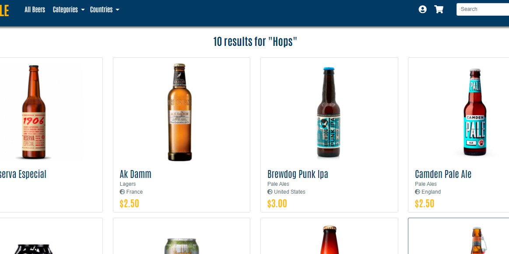 

  - If a user clicks the search button without inputting a word in the search bar, a message is displayed to warn them that they have not entered any search criteria, and they are redirected to the All Beers page.

    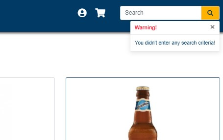 

- Responsive design:
    - 'Hamburger' toggle button: For smaller screens, the hamburger toggle button appears and, when clicked, shows/hides navbar links. 
    - The homepage image is repositioned, and slogan becomes smaller and is repositioned. Buy beer button is also repositioned.

    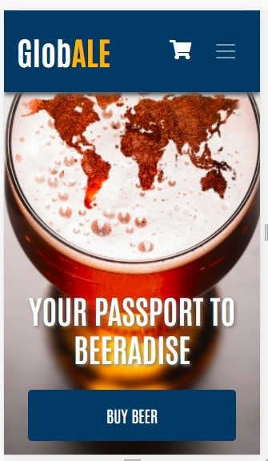 

### **Products Page**
- When a user is on the 'All Beers' / general Products page, they are shown all of the products on the store, which are displayed in alphabetic order.
- Each product card contains the correct image, name, category, country and price. 
- When a user hovers over a product, the border changes color. When they click on the product image, they are taken to the Product Detail page.
- When a user clicks on the 'country' link in the product card, they are directed to the correct category page.
- When a user clicks on the 'category' link in the product card, they are directed to the correct country page.
- When a user lands on the Products page after having chosen a particularly category or country, they are shown a correct list of products for that particular chosen country or category only. The correct page heading displays for each chosen category or country.

  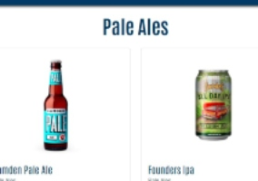 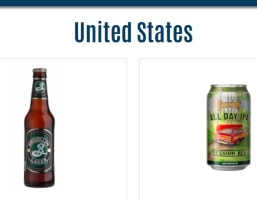 

- Responsive design:
  - Four product cards displayed per row for laptop / monitor screens
  - Two product cards displayed per row for tablet screens.
  - Images and texts resized to allow two products to be correctly displayed per row correctly for mobile screens.

    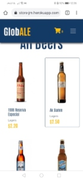 

### **Product Detail Page**

- Clicking on a product from the Product page, directs users to the correct Product Detail page, which renders the product image, all relevant product information (name, brewer, description, price, size, ABV), a quantity input and 'Add to Cart' button, as well as a reviews form (if user is logged in), and product reviews and average (if any).
- Above the product image, three 'back' links appear allowing users to return to the All Beers section, or the relevant category or country. When clicked, each link returns user to the correct All Beers, category or country page. 

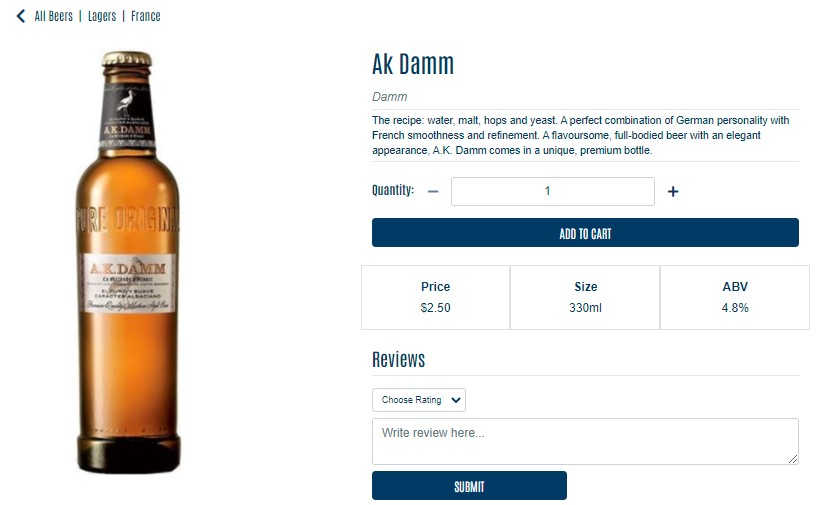 

- For users that are not logged in, the reviews form is not displayed, instead a message is displayed prompting them to sign in or register to leave a review. 

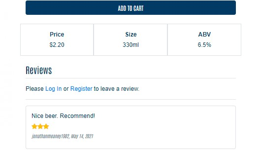 

- For a product that does not have reviews, a message appears to inform the user that no reviews have been added for the product yet.

  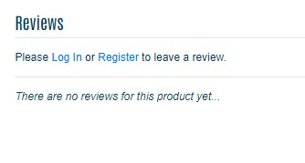 

- For a product that has reviews, the reviews are displayed correctly in date order and the average rating is calculated correctly based on the sum of all ratings. 

  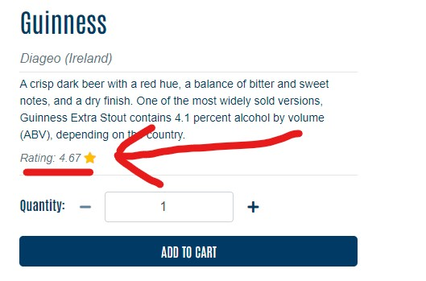 

- Adding product to shopping cart:
  - Quantity Inputs:
    - 'Plus' button increases the quantity by one with each click. 
    - 'Plus' button is disabled when user reaches 99.
    - 'Minus' button decreases the quantity by one with each click. 
    - 'Minus' button is disabled when quantity is at 1. As such, 'Minus' button is initially disabled as the default quantity is 1. Once user clicks the 'Plus' button once to reach 2, the 'Minus' button is enabled.

  - 'Add to Cart' button:
    - Changes color when hovered over.
    - Once user clicks the 'Add to Cart' button, the selected quantity is added to their shopping cart.
    - A message appears to inform them that the selected quantity of the product has been added to the shopping cart. 
    - Shopping cart icon turns from white to orange to indicate there is something in the Cart, and next to it a number is displayed representing the number of items in the cart.

    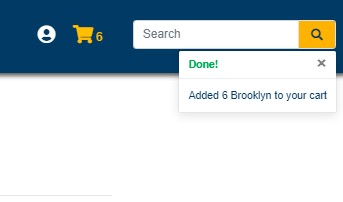 

    - Should a user accidentally delete the quantity from the input bar and then click 'Add to Cart', the quantity will be set to 1 as default and 1 item of the product will be added to the cart. A message appears to inform them that 1 item has been added to their cart.
    - Should a user try to manually enter a number lower than 1 or higher than 99, they will not be able to proceed and will be prompted with a message to tell them they must choose a quantity between 1 and 99.

- Review Form:
    - Review form displays for logged in users only.
    - When user completes form and clicks submit (submit button correctly changes color when hovered over), their review is immediately added to top of the reviews section (reviews are displayed in date order, most recent first), along with their username and the date of the review.
    - A message appears to tell them that there review for the product was added successfully added.
    - The average rating is updated correctly based on the sum of all ratings and taking into account the newly added rating.

      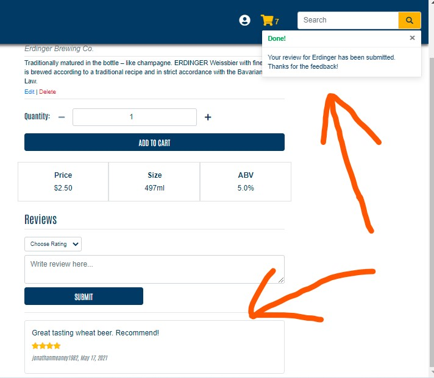 

    - If the user tries to submit the review without selecting a rating, they will be not be able to proceed and will be prompted to choose a rating.

      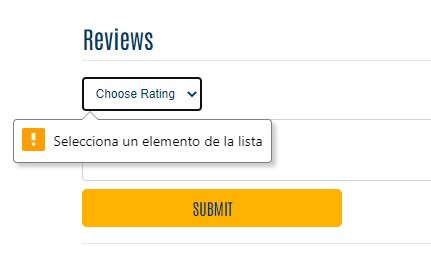 

    - If user leaves review content text input empty, the review will be submitted with just a rating.

- Responsive design: 

  - On mobile screens, all elements stack on top of each other correctly. 

    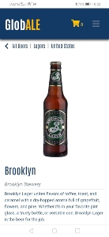 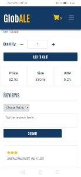 

### **Shopping Cart Page**

- Clicking on the Cart link in the navbar directs users to the Shopping Cart page.
- The Shopping Cart page correctly displays all products added to the Shopping cart; all relevant cash totals are displayed and calculated correctly (Subtotal, Cart Total, Delivery and Order total). 

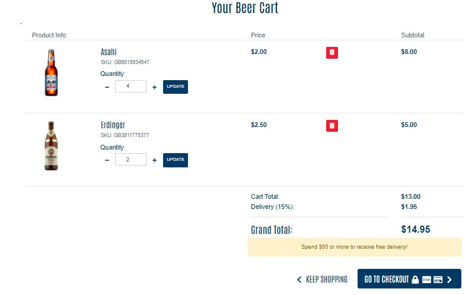 

- Update quantity: 
  - 'Plus' button increases the quantity by one with each click. 
  - 'Plus' button is disabled when user reaches 99
  - 'Minus' button decreases the quantity by one with each click. 
  - 'Minus' button is disabled when quantity is at 1.
  - Update button: changes color when hovered over. When clicked, the quantity of product is updated and a message appears to tell the user the quantity has been updated successfully.

  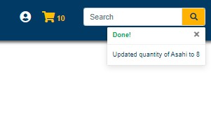 

  - Cash totals update correctly after update.
- Delete product:
  - When hovered over the delete button changes color.
  - When clicked, the product is deleted from cart and a message appears to tell the user the product has been deleted successfully.

    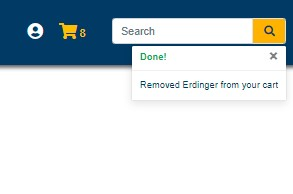 

  - Cash totals update correctly after delete. 
- Delivery totals and free delivery alert bar:
  - When the cart total is below the free delivery threshold ($50), the free delivery alert bar appears under the grand total. Delivery charge is calculated correctly and is added to the cart total to give the grand total.

    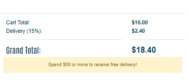 

  - When the cart total is above the free delivery threshold ($50), the free delivery alert does not appear, 'Delivery' is crossed out and Delivery total is $0. 

    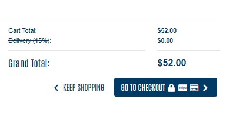 
    
- 'Go to Checkout' button: Changes color when hovered over, directs user to the Checkout page.
- 'Keep Shopping' button: directs user back to the 'All Beers' Product page, items remain in the users cart to complete purchase at a later point.
- Responsive design: 
  - For mobile screens, the Shopping Cart page layout is reconfigured correctly. 

    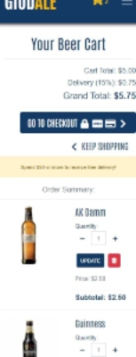 

### **Checkout Page**

- When the user clicks on the 'Go to Checkout' button on the Cart page, they are correctly directed to the Checkout page.

- The order summary shown in the Checkout Page matches the contents of the Shopping cart; correctly displays the products, quantity and cash totals from the Shopping Cart page.

- Payment / Order Processing:

  - Once the checkout form details are filled in correctly and the user clicks "Complete Payment" button:
    - The user is directed to the order confirmation page, which displays the order confirmation number, a correct order summary and delivery details.
    - A message appears to inform that the order was completed successfully. 

      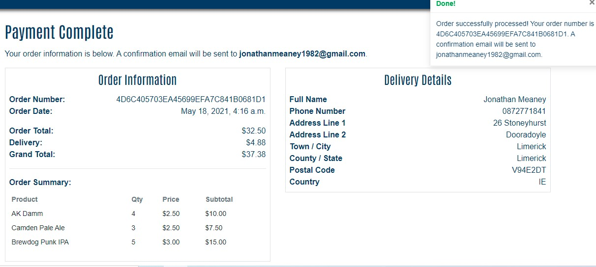 

    - The payment intent is successfully created on Stripe. 
    
      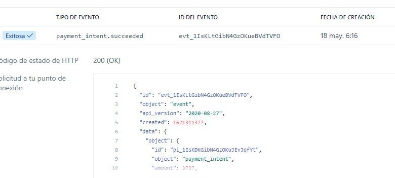 
    
    - A confirmation email is sent to the customer correctly. 
    
      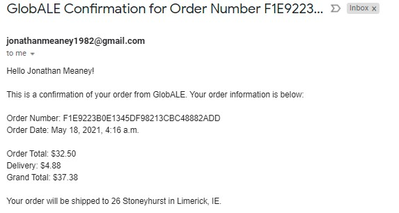 

    - The order is added to the database correctly. 

      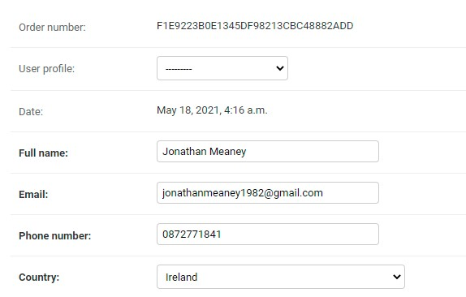 

    - The payment amount matches the order Grand Total orignally generated in the Shopping Cart page.

  - If the user closes the page before the order is processed: 
    - The order will still be created on stripe using a webhook and added to the database. 
    
      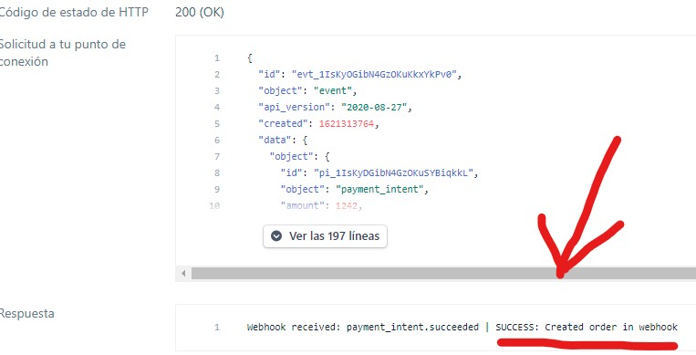 

    - An order confirmation email is still sent correctly to the customer.

- Handling form errors:

  - If a user tries to Complete Payment without completing all of the required form fields, they will not be able to proceed and prompted to fill in the necessary fields. 

    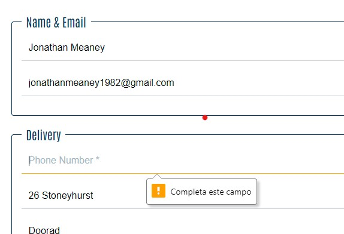 

  - If a user enters incorrect details, they will not be able to proceed with the payment and a message will inform them of the error. 

    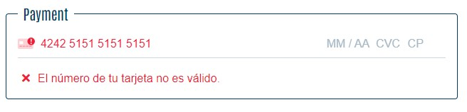 

- Form details for logged in users:

  - If the logged in user checks the "Save this delivery information to my profile" box, the delivery details are successfully saved in the user's User Profile.
  - If the user has previously saved their delivery information, the form is autofilled correctly with these previously saved details. 

- Responsive design:
  
  - On mobile screens, all elements correctly stack on top of each other for both the Checkout page and Order Confirmation page.

    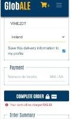 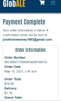 

### **My Profile Page**

- Clicking on the My Profile link from the Profile dropdown menu correctly directs authenticated users to the My Profile Page 
- A blank form is generated for users who have not previously saved delivery information.
- For users who have previously saved their delivery information the form is auto-filled with the previously saved details.
- When a user edits their details and clicks 'Update Information', the details are correctly updated and a message appears to inform the user that their information has been updated successfully. 

  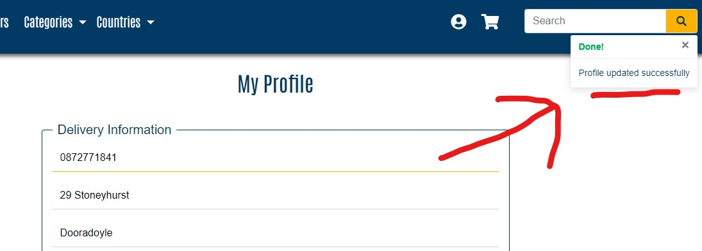 

-  The user's information is correctly updated on the database.
- Authentication:
  - Only registered, logged in users can access the My Profile page (the link is correctly hidden from non-authenticated users).
  - If a non-authenticated user tries to access the My Profile page by typing the URL into the web browser, they are correctly redirected to the login page.

### **Order History Page**

- Clicking on the Orders link from the Profile dropdown menu correctly directs authenticated users to the Order History page.

- A list of the user's previous orders is generated correctly. Clicking the 'See Details' shows the full order details. 

  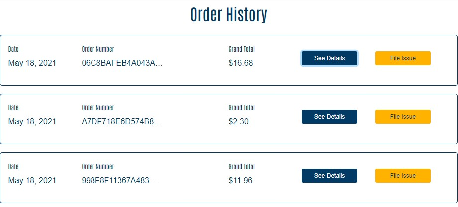  

- File an Issue: 

  - Clicking the 'File Issue' button correctly directs the user to the File Issue form submission page.

    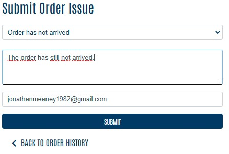 

  - Once the user fills in the form and clicks 'Submit':

    - The user is redirected to the Order History page and message appears to inform that their issue has been logged successfully.

    - A red message appears on the order to indicate that an issue has been logged for said order. 

      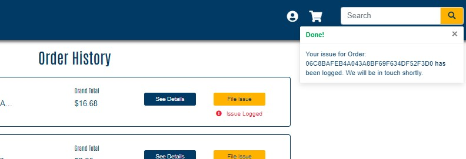 

    - The order issue is successfully logged in the database.

      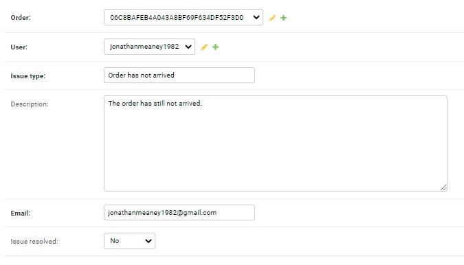 

    - Once admin has dealt with the issue and changed "Issue Resovled" to "Yes", a green message appears on the order in the user's Order History page to indicate the issue has been resovled. 

      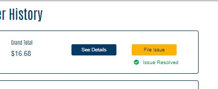 

- Authentication:
   - Only registered, logged in users can access the Order History page (the link is correctly hidden from non-authenticated users).
  - If a non-authenticated user tries to access the Order History page by typing the URL into the web browser, they are correctly redirected to the login page.
  
- Responsive design:

  - The layout of the Order History page is reconfigured for mobile screens.

    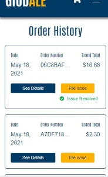 

  - When clicking the 'See Details' button on mobile screens, the user is directed to the order confirmation and is informed that this a a past order confirmation.   

    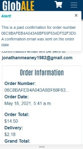 

    - The user is correctly directed back to the Order Histroy page when they click the "Back to Order History" button on this Previous Order Confirmation page.

- Elements of the Submit Order Issue page correctly stack on top of each other on small screens.

### **Product Management Page (Add a Product)**

- Clicking on the Product Management link from the Profile drop-down menu correctly directs superusers to the Add a Product page.
- Once the user fills in the form correctly and presses 'Add a Product':
  - The product is added to the database correctly.
  - The user is redirected to the Product Detail page for the new product.
  - A message appears to tell them that the product has been added successfully. 

    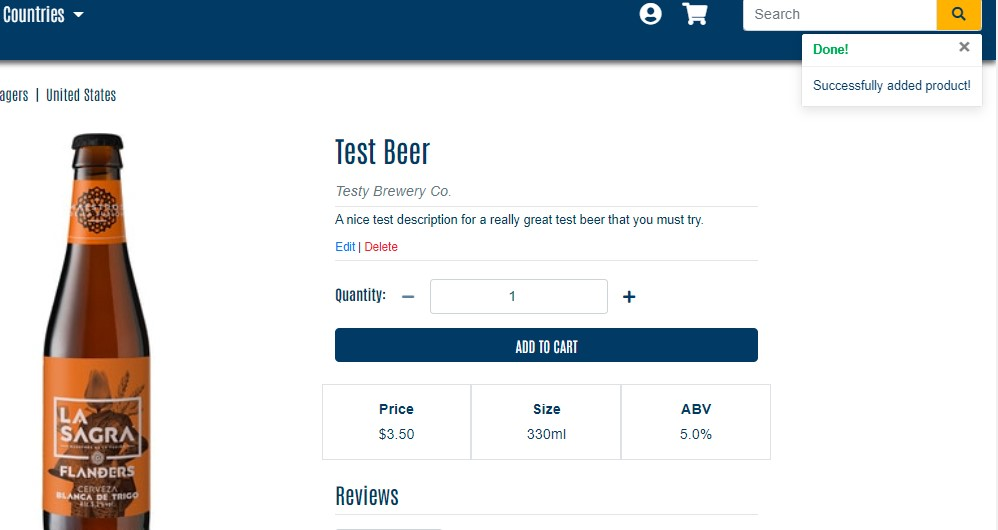 

  - If user adds a product without an image, a generic image is automatically generated. 

    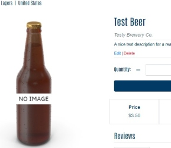 

- Handling form errors:
  - If the user tries to submit the form without completing a required field, they are not be able to proceed and will be prompted to fill in the field in question. 

    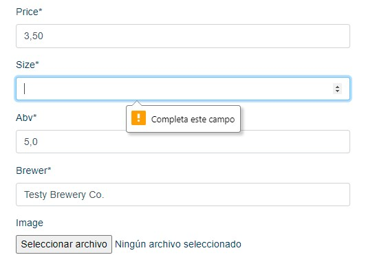 

  - If the user completes a field with invalid values, they are not be able proceed and a message informs them of the error. 

    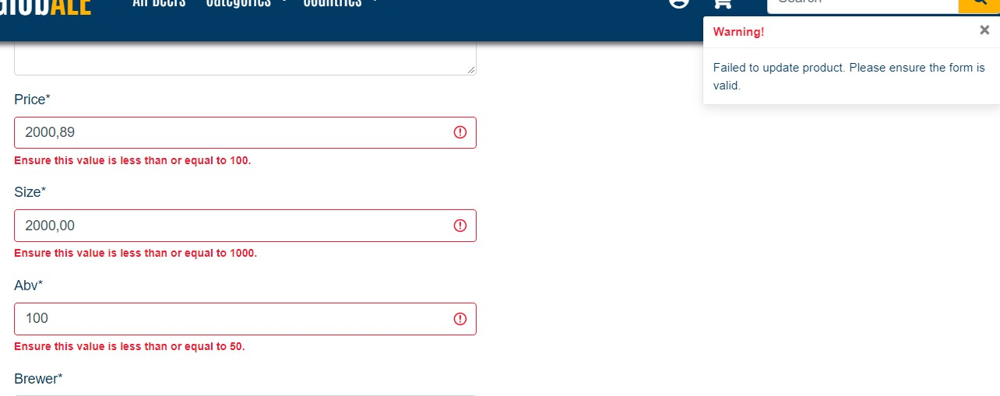 

- Authentication:
  - The Product Management link only appears for logged in superusers.
  - If a non-logged in user tries to access the Product Management page by typing the URL into the web browser, they are correctly redirected to the login page.
  - If a logged-in registered user who does not have superuser status tries to access the Product Management page by typing the URL into the web browser, they are correctly redirected to the homepage; a message appears to inform them that they do not have permission to access this part of the site. 

    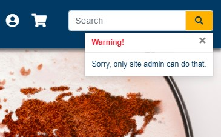 

### **Edit a Product**

- When a superuser clicks on the Edit link in the product card on the Product page, or in the Products Details page, they are correctly directed to the Edit Product page.
- The Edit Product form appears, with all the forms fields correctly pre-filled with the product's current details. 
- Having edited the desired field(s) and clicked "Update Product":
  - The product is updated on the database correctly.
  - The user is redirected to the Product Detail page for the updated product where they can sees the changes applied.
  - A message appears to tell them that the product has been added successfully. 

    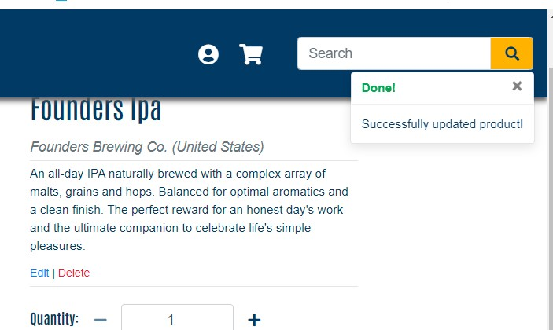 

- Handling form errors:
  - If the user tries to submit the form without completing a required field, they are not be able to proceed and will be prompted to fill in the field in question. 
  - If the user completes a field with invalid values, they are not be able proceed and a message informs them of the error. 
- Authentication:
  - The Edit link only appears for logged in superusers.
  - If a non-logged in user tries to access the Edit page by typing the URL into the web browser, they are correctly redirected to the login page.
  - If a logged-in registered user who does not have superuser status tries to access the Edit page by typing the URL into the web browser, they are correctly redirected to the homepage; a message appears to inform them that they do not have permission to access this part of the site. 

### **Delete a Product**

- When a superuser clicks on the Delete link in the product card on the Product page, or in the Products Details page:
  - The product is deleted from the database.
  - A message appears to inform the user that the product has been deleted successfully.
  - The product no longer appears on the Products page.

    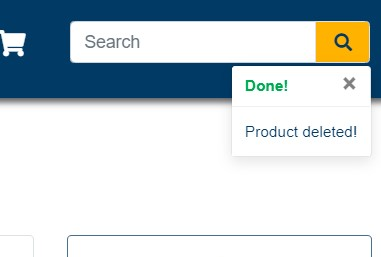 

- Authentication:
  - The Delete link only appears for logged in superusers.
- Some recognized downfalls:
  - The developer is aware that to improve UX, the delete functionality could be improved by giving users a chance to confirm the delete after clicking 'Delete' the first time. However due to time constraints, this functionality has not been included in the MVP version and will be added in later versions.

### **Registration**

- All Registration links working correctly:
  - The 'Register Link' in the navbar Profile dropdown menu only appears for non-logged in users, and correctly directs users to the Sign Up page.
  - The 'Register Link' in the reviews section of the Product Details page only appears for non-logged in users, and correctly directs users to the Sign Up page.
  - The 'Register Link' in the Checkout page only appears for non-logged in users, and correctly directs users to the Sign Up page.
  - The 'Register Link' in the Sign In page correctly directs users to the Sign Up page. 

  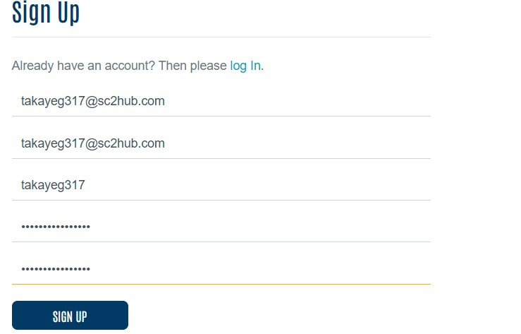 

- On the Sign Up page, once the user fills in the fields correctly and clicks 'Sign Up':
  - They are redirected to the Verify Email page; a message appears to inform them a confirmation email has been sent. 

    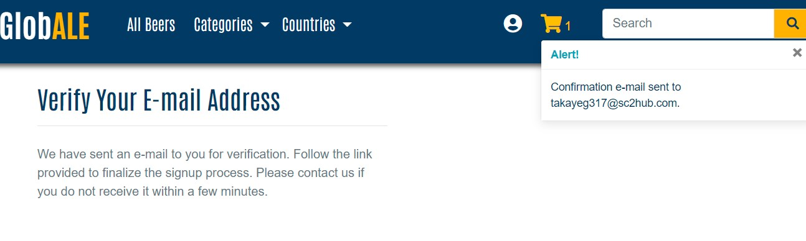 

  - Email is correctly sent to the email address provided in the registration form. 

    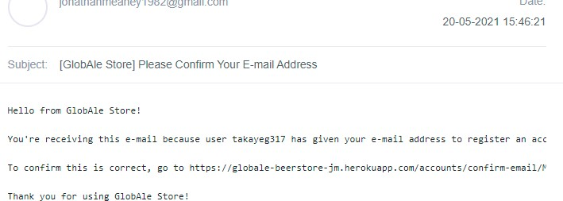 

  - Clicking on the link directs users to the Confirm Email Address page. When the user clicks Confirm:
    - They are redirected to Sign In page,  a  message appears to tell them that their email has been confirmed. 

      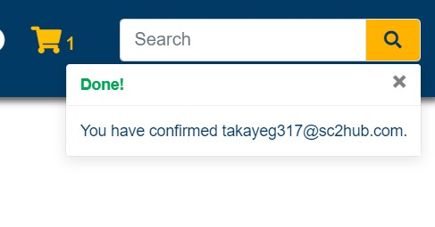 

    - After entering their username/email and password provided in the registration form and clicking 'Sign In', they are successfully logged in and a message appears to inform them that they have have signed in succesfully. 

      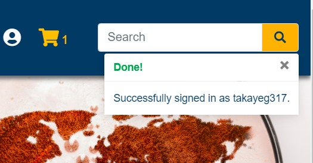 

- Handling Registration form errors: 
  - If a user tries to submit the form without completing a field, the user will not be able to proceed and they are prompted to complete the necessary field.

     

  - If the user tries to submit the form, and the email and confirm email fields don't match, the user will not be able to proceed and will be prompted to fix the error. 

     

  - If the user tries to submit the form, and the password and confirm password fields don't match, the user will not be able to proceed and will be prompted to fix the error. 
  
     

  - If the user tries to submit the form, having choosen an email or username that already exists for another registered user, the user will not be able to proceed and will be prompted to choose another email or username. 

     

### **Sign In**

- All Sign In links working correctly:
  - The 'Sign In' link in the navbar Profile dropdown menu only appears for non-logged in users, and correctly directs users to the Sign In page.
  - The 'Sign In' link in the reviews section of the Product Details page only appears for non-logged in users, and correctly directs users to the Sign In page.
  - The 'Sign In' link in the Checkout page only appears for non-logged in users, and correctly directs users to the Sign In page. 
  - The 'Sign In' link  in the Register page correctly directs users to the Sign In page. 
- On the Sign Up page, once the user fills in the fields correctly and clicks 'Sign In'
  - A message appears to tell the user that they have signed in successfully. 

     

- Handling Sign In form errors: 
  - If a user tries to submit the form without completing a field, the user will not be able to proceed and they are prompted to complete the necessary field. 

     

  - If the user tries to submit the form, having typed an incorrect email and/or password, they will not be able to proceed and are prompted to fix the error.  

    

- Forgot Password:
  - Clicking the 'Forgot Password' link, directs the user to the Password Reset page. 
  - Clicking 'Back to Login' link on the Password Reset Page correctly redirects users to the Sign In page.
  - On the Password Reset page, once the user enters their registered email and clicks 'Reset Password' :
    - They are informed they have received an email in the Password Reset page.
    - An email is sent to their registered email address with a link that allows them to reset their password. 

    

  - Clicking on the link directs users to the Change Password page. Once they fill in their new password twice correctly and click 'Change Psssword', a message appears to inform them that their password has been successfully changed.
  - The user can successfully log in with this new password. 
- Handling Reset Password form errors:
  - On the Password Reset page, if the user enters an email that is not assigned to a user account, they will not be able to proceed and will be prompted to fix the error. 
  
    

  - On the Change Password page, if the user tries to submit the form, and the password and confirm password fields don't match, the user will not be able to proceed and will be prompted to fix the error.

    

  - If a user clicks on an old reset password link after having previously used this link to reset their password, they are redirected to the Bad Token page, which informs that the "password reset link was invalid". Here the new password reset link correctly and directs them to the Reset Password page. 

    

### **Log Out**

- The 'Sign Out' link in the navbar Profile dropdown menu only appears for logged in users, and correctly directs users to the Sign Out page.
- On the Sign Out page, clicking 'Cancel' will redirect the user to the home page and they will remain logged in.
- Clicking 'Sign Out', the user will be signed out of the website, the are redirected to the homepage and a message appears to tell them that they have successfully signed out. 

  

## **VALIDATION**

W3C Markup Validator, W3C CSS Validator, PEP8 Validator and JSHint were used to validate the code in the project to ensure there were no errors.

- [W3C Markup Validator](https://validator.w3.org/)

    - No errors were detected in any of the HTML code after finally running the code through the validator.

- [W3C CSS Validator](https://jigsaw.w3.org/css-validator/#validate_by_input)

    - No errors in the CSS code were detected after finally running the CSS code through the validator.

- [JSHint](https://jshint.com/)

    - No errors were detected in the Javascript/JQuery code after finally running the code through JSHint.

- [PEP8 Code Checker](http://pep8online.com/)

    - No PEP8 errors were detected in the Python code after finally running the code through the PEP8 code Checker

## **KNOWN BUGS**

- On the Firefox browser, in the product quantity inputs on the Product Detail page and Products page, the default up/down arrows are visible but do not function. However the customized plus/minus buttons work as intended so it is not a major issue.

  

### **Dupliate Orders bug:**
  
  - On sporadic occasions, processed orders are duplicated in the system. The reason for this is that the webhook on Stripe creates the order before allowing the regular process to handle it, and then the regular process is completed. The reason for this is still unknown but solving the webhook issue was not possible within the time contraints for the MVP version.
  - It seems the webhooks for both development and deployment versions are linked, as a webhook is sent to both versions regardless of which version the order was processed in. 
  - Having consulted with tutors and my colleagues on Slack, I tried several solutions, such as increasing the while loop attempt in the webhook handler and disabling the webhook endpoint for the development version of the project. However the problem still persists, but only happens occasionally.
  - Temporary solution for this MVP version: 
    - In order to improve UX, I have disabled the webhook posting the user's profile to the order form data when the webhook handles the order. This means the duplicated order created by the webhook will not appear in the user's order history, which would be extremely poor UX. Only the order that was created by the regular process will be added to the user's order history.
    - As such, the duplicated orders will only appear in the Django admin database and the admin user can easily spot them as they will have the exact same details and same timestamp. 
    - The only downfall of having disabled the webhook posting the user's profile to the order form data when the webhook handles the order:
      - In the rare case that the webhook handler solely creates the order (for example, when a user closes the checkout page before the order process is completed), it means that this order will not be posted to the logged in user's order history.
      - Although the user will still receive the confirmation email, so they will not be left in doubt as to whether the order has been completed. 